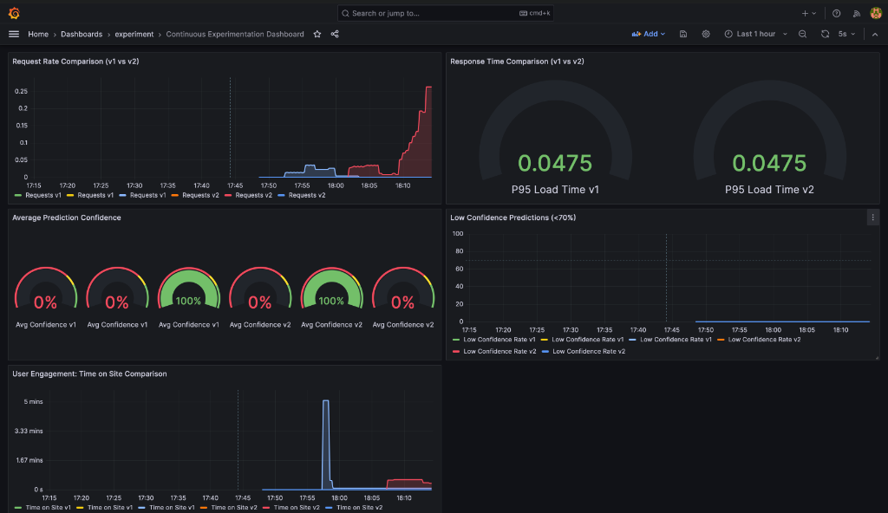

# Continuous Experimentation: Prediction Confidence Score Feature

## Overview

This experiment evaluates whether displaying ML model confidence scores improves user engagement. Two versions of the SMS Spam Detection app are deployed simultaneously using Istio traffic management for A/B testing.

**Version Comparison**:
- **v1 (0.0.97)**: Baseline version - users receive only spam/ham classification without additional model information
- **v2 (0.0.98)**: Experimental with confidence score display

**Traffic Split**: 90% v1, 10% v2 (sticky sessions via cookies)  
**Routing**: Istio ensures v1-v1 and v2-v2 service pairing (no cross-version communication)

## Experimental Feature

**v2 adds confidence score display**:
- Visual progress bar showing model certainty (0-100%)
- Color-coded: Green (≥80%), Yellow (60-79%), Red (<60%)
- Calculated from model's `predict_proba()` probability estimates

**Technical Implementation**:
```python
# Model service extracts confidence from sklearn classifier
probabilities = clf.predict_proba(processed_sms)[0]  # e.g., [0.08, 0.92]
predicted_class_idx = list(clf.classes_).index(prediction)
confidence = float(probabilities[predicted_class_idx])  # 0.92
```

## Hypothesis

**Displaying confidence scores will increase user engagement by ≥15%** (measured via time-on-site), without degrading performance or model quality.

## Metrics

All metrics auto-labeled by Prometheus with `version={v1|v2}` from pod metadata:

| Metric | Type | Purpose |
|--------|------|---------|
| `click_rate_total` | Counter | Button clicks (predictions requested) |
| `time_on_site_seconds` | Gauge | Average session duration |
| `prediction_confidence_avg` | Gauge | Average confidence (v2 only) |
| `low_confidence_predictions_total` | Counter | Predictions with confidence <0.7 |
| `page_load_seconds` | Histogram | Page load distribution |

## Decision Criteria

**After 7 days with ≥1,000 requests per version:**

| Criterion | Threshold | Status |
|-----------|-----------|--------|
| Time on site increase | ≥ +15% | **PRIMARY** |
| Performance impact | < +5% | **BLOCKER** (frontend page load) |
| Low confidence rate | < 30% | **QUALITY** |

**Decision Process**:
After 7 days, query Grafana for each metric (see queries below), calculate percentage improvements, and compare against thresholds. All three criteria must pass to adopt v2. For example, if v1 avg time-on-site = 120s and v2 = 138s, the improvement is ((138-120)/120)*100 = 15%, meeting the ≥15% threshold. Similarly calculate performance impact from P95 latencies and low confidence rate from prediction counts.

**Decision**:
- **ADOPT v2** if time-on-site ≥ +15%, performance < +5%, and low confidence < 30%
- **KEEP v1** if ANY criterion fails

## Grafana Dashboard

The **Continuous Experimentation Dashboard** visualizes all decision metrics in a single view, enabling side-by-side comparison of v1 and v2 performance. The dashboard automatically updates every 5 seconds with the latest Prometheus data.

**5 Panels**:
1. **Request Rate** (Time Series) - Validates 90/10 traffic split is maintained throughout experiment
2. **Response Time** (Gauge) - Shows P95 latency for both versions to detect performance degradation
3. **Average Confidence** (Gauge) - Displays mean confidence score with color thresholds (v2 only)
4. **Low Confidence Rate** (Time Series) - Tracks percentage of uncertain predictions over time
5. **Time on Site** (Time Series) - Primary engagement metric showing session duration trends

**Key Prometheus Queries**:
```promql
# Time on site comparison (primary metric)
avg_over_time(time_on_site_seconds{version="v1"}[7d])
avg_over_time(time_on_site_seconds{version="v2"}[7d])

# Performance check (blocker criterion)
histogram_quantile(0.95, rate(page_load_seconds_bucket{version="v1"}[7d]))
histogram_quantile(0.95, rate(page_load_seconds_bucket{version="v2"}[7d]))

# Low confidence rate (quality check)
rate(low_confidence_predictions_total{version="v2"}[7d]) / rate(click_rate_total{version="v2"}[7d])
```

**Dashboard Screenshot**: 
 

## Implementation

**Istio Traffic Management**:
- VirtualService: 90/10 weight + cookie (`exp_canary=v1|v2`)
- DestinationRule: Subsets based on `version` label

**Prometheus**:
- Scrapes `/metrics` every 30s
- Relabels pods with `version` from Kubernetes metadata
- Retention: 1 day

**Version Configuration** (`values.yaml`):
```yaml
appVersions:
  v1: {tag: "0.0.97"}  # Stable
  v2: {tag: "0.0.98"}  # Experimental

modelService:
  v1: {tag: "v0.2.0"}  # Both use same model
  v2: {tag: "v0.2.0"}
```