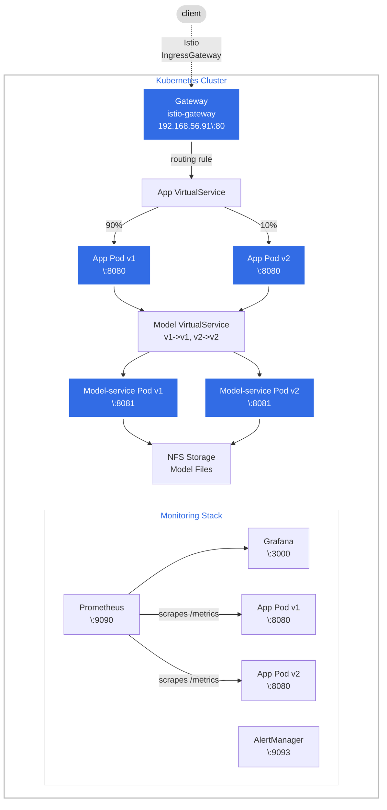
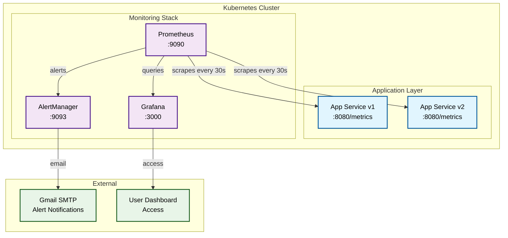
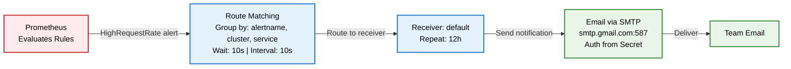
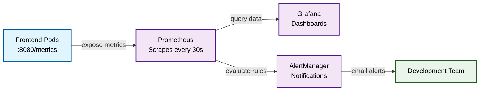

# Deployment Documentation

This document describes the complete deployment architecture of the SMS Spam Detection System on Kubernetes with Istio service mesh for traffic management and canary deployments.

---

## Table of Contents
1. [System Overview](#system-overview)
2. [Deployment Architecture](#deployment-architecture)
3. [Kubernetes Resources](#kubernetes-resources)
4. [Data Flow & Request Routing](#data-flow--request-routing)
5. [Istio Traffic Management](#istio-traffic-management)
6. [Monitoring Stack](#monitoring-stack)
7. [Additional Use Case: Rate Limiting](#additional-use-case-rate-limiting)
8. [Access Information](#access-information)

---

## System Overview

The SMS Spam Detection System is a microservices-based application deployed on a Kubernetes cluster provisioned via Vagrant. It uses Istio for traffic management, enabling canary deployments and A/B testing.

### Technology Stack

| Component | Technology | Port |
|-----------|------------|------|
| Frontend (app-service) | Spring Boot / Java 25 | 8080 |
| ML Backend (model-service) | Flask / Python 3.12 | 8081 |
| Shared Library | lib-version (Maven) | - |
| Orchestration | Kubernetes v1.30 | - |
| Service Mesh | Istio 1.25.2 | 80/443 |
| Monitoring | Prometheus | 9090 |
| Visualization | Grafana | 3000 |
| Alerting | AlertManager | 9093 |

### Repository Structure

| Repository | Purpose | Link |
|------------|---------|------|
| [operation](https://github.com/doda25-team6/operation) | Helm charts, Vagrant, Ansible, Kubernetes manifests | Main deployment |
| [app](https://github.com/doda25-team6/app) | Spring Boot frontend service | `ghcr.io/doda25-team6/app` |
| [model-service](https://github.com/doda25-team6/model-service) | Flask ML prediction service | `ghcr.io/doda25-team6/model-service` |
| [lib-version](https://github.com/doda25-team6/lib-version) | Version-aware Maven library | GitHub Packages |

---

## Deployment Architecture

### High-Level Architecture



The architecture implements a canary deployment pattern where external traffic enters through the Istio IngressGateway at 192.168.56.91. The Gateway forwards requests to a VirtualService which performs intelligent routing: first-time visitors are randomly assigned to either v1 (90%) or v2 (10%) and receive a cookie (`exp_canary`), while returning visitors are routed consistently to their assigned version based on this cookie. Both app versions communicate with their corresponding model-service versions through a separate VirtualService that ensures version consistency (v1 app calls v1 model, v2 app calls v2 model). All model-service pods share access to trained ML models stored on NFS-backed persistent storage mounted from the controller node. The monitoring stack operates independently, with Prometheus scraping metrics exclusively from the frontend pods, feeding data to Grafana dashboards for visualization and AlertManager for notification when request rates exceed defined thresholds.

### Infrastructure Layout

| Node | IP Address | Role | Components |
|------|------------|------|------------|
| ctrl | 192.168.56.100 | Control Plane | API Server, etcd, Scheduler, NFS Server |
| worker1 | 192.168.56.101 | Worker | Application pods |
| worker2 | 192.168.56.102 | Worker | Application pods |

---

## Kubernetes Resources

The system is deployed as a collection of Kubernetes resources managed through a Helm chart. The deployment consists of 7 Deployments (dual-version app and model-service for canary testing, plus single-instance monitoring services), each exposed through ClusterIP Services. Configuration is externalized through ConfigMaps containing application environment variables, Prometheus scrape targets, Grafana datasource definitions, dashboard JSON files, and AlertManager routing rules. Persistent storage is implemented via an NFS-backed PersistentVolume (1Gi) mounted from the controller node at `/srv/nfs/model`, accessible to all model-service pods through a ReadWriteMany PersistentVolumeClaim. Istio traffic management is configured through Gateway (external entry point), VirtualServices (routing logic with cookie-based canary), and DestinationRules (subset definitions and consistent hashing). External access is provided through both Istio IngressGateway (192.168.56.91 for application) and Nginx Ingress (192.168.56.90 for monitoring dashboards), each assigned LoadBalancer IPs from MetalLB's address pool.

### Complete Resource Map

```
┌──────────────────────────────────────────────────────────────────────────────┐
│                            KUBERNETES RESOURCES                              │
├──────────────────────────────────────────────────────────────────────────────┤
│                                                                              │
│  DEPLOYMENTS                          SERVICES                               │
│  ════════════                         ═════════                              │
│  ┌─────────────────────────┐         ┌─────────────────────────┐             │
│  │ project-project-app     │────────▶│ -frontend :8080         │             │
│  │ (app v1, 3 replicas)    │         └─────────────────────────┘             │
│  └─────────────────────────┘                                                 │
│  ┌─────────────────────────┐         ┌─────────────────────────┐             │
│  │ project-project-app-v2  │────────▶│ (same service, v2 pods) │             │
│  │ (app v2, 3 replicas)    │         └─────────────────────────┘             │
│  └─────────────────────────┘                                                 │
│  ┌─────────────────────────┐         ┌─────────────────────────┐             │
│  │ project-project-app-    │────────▶│ -model :8081            │             │
│  │ model (v1, 3 replicas)  │         └─────────────────────────┘             │
│  └─────────────────────────┘                                                 │
|  ┌─────────────────────────┐         ┌─────────────────────────┐             │
│  │ project-project-app-    │────────▶│ (same service, v2 pods) │             │
│  │ model (v2, 3 replicas)  │         └─────────────────────────┘             │
│  └─────────────────────────┘                                                 │
│  ┌─────────────────────────┐         ┌─────────────────────────┐             │
│  │ -prometheus             │────────▶│ -prometheus :9090       │             │
│  └─────────────────────────┘         └─────────────────────────┘             │
│  ┌─────────────────────────┐         ┌─────────────────────────┐             │
│  │ -grafana                │────────▶│ -grafana :3000          │             │
│  └─────────────────────────┘         └─────────────────────────┘             │
│  ┌─────────────────────────┐         ┌─────────────────────────┐             │
│  │ -alertmanager           │────────▶│ -alertmanager :9093     │             │
│  └─────────────────────────┘         └─────────────────────────┘             │
│                                                                              │
│  CONFIGMAPS                           STORAGE                                │
│  ═══════════                          ═══════                                │
│  ┌─────────────────────────┐         ┌─────────────────────────┐             │
│  │ -config (MODEL_HOST)    │         │ PV: model-pv-nfs (1Gi)  │             │
│  │ -prometheus (scrape)    │         │        │                │             │
│  │ -grafana-datasources    │         │        ▼                │             │
│  │ -grafana-dashboards     │         │ PVC: model-pvc          │             │
│  │ -alertmanager-config    │         │   (ReadWriteMany)       │             │
│  └─────────────────────────┘         └─────────────────────────┘             │
│                                                                              │
│  ISTIO RESOURCES                                                             │
│  ═══════════════                                                             │
│  ┌─────────────────────────┐  ┌─────────────────────────────────────────┐    │
│  │ Gateway                 │  │ VirtualService: app-entry-service       │    │
│  │ (istio-gateway)         │  │ VirtualService: model-service-vs        │    │
│  └─────────────────────────┘  └─────────────────────────────────────────┘    │
│  ┌─────────────────────────┐  ┌─────────────────────────────────────────┐    │
│  │ DestinationRule         │  │ DestinationRule: app-dr (v1/v2 subsets) │    │
│  │ (sticky sessions)       │  │ DestinationRule: model-service-dr       │    │
│  └─────────────────────────┘  └─────────────────────────────────────────┘    │
│                                                                              │
└──────────────────────────────────────────────────────────────────────────────┘
```

### Resource Summary

| Type | Count | Names |
|------|-------|-------|
| Deployments | 7 | app (v1/v2), model (v1/v2), prometheus, grafana, alertmanager |
| Services | 5 | frontend, model, prometheus, grafana, alertmanager |
| ConfigMaps | 5 | app-config, prometheus-config, grafana-datasources, grafana-dashboards, alertmanager-config |
| Secrets | 1 | app secrets |
| PersistentVolume | 1 | NFS-backed model storage |
| PersistentVolumeClaim | 1 | model-pvc |
| Ingress | 1 | nginx ingress for project.local |

---

## Data Flow & Request Routing

### Request Flow

```
    ┌─────────────────────────────────────────────────────────────────────────┐
    │                         REQUEST FLOW                                    │
    └─────────────────────────────────────────────────────────────────────────┘

    Step 1: User Request
    ════════════════════
    User ──────▶ http://192.168.56.91/sms
                        │
                        ▼
    ┌───────────────────────────────────────────┐
    │  ISTIO INGRESSGATEWAY                     │
    │  - Entry point for all external traffic   │
    │  - IP: 192.168.56.91, Port: 80            │
    └─────────────────────┬─────────────────────┘
                          │
    Step 2: Gateway Match │
    ══════════════════════│
                          ▼
    ┌───────────────────────────────────────────┐
    │  GATEWAY (istio-gateway)                  │
    │  - Matches host: *                        │
    │  - Protocol: HTTP                         │
    └─────────────────────┬─────────────────────┘
                          │
    Step 3: VirtualService Routing
    ═══════════════════════════════
                          ▼
    ┌───────────────────────────────────────────┐
    │  VIRTUALSERVICE (app-entry-service)       │
    │                                           │
    │  Route 1: IF cookie exp_canary=v1:        │
    │    → Route to subset v1 (100%)            │
    │                                           │
    │  Route 2: IF cookie exp_canary=v2:        │
    │    → Route to subset v2 (100%)            │
    │                                           │
    │  Route 3: No cookie (first visit):        │
    │    → 90% to v1 + set cookie exp_canary=v1 │
    │    → 10% to v2 + set cookie exp_canary=v2 │
    │    (Cookie Max-Age: 3600s / 1 hour)       │
    └─────────────────────┬─────────────────────┘
                          │
    Step 4: Subset Selection
    ════════════════════════
                          ▼
    ┌───────────────────────────────────────────┐
    │  DESTINATIONRULE (app-dr)                 │
    │                                           │
    │  Subsets:                                 │
    │    v1 → pods with label version=v1        │
    │    v2 → pods with label version=v2        │
    │                                           │
    │  Load Balancer:                           │
    │    consistentHash on cookie header        │
    │    (ensures same pod within subset)       │
    └─────────────────────┬─────────────────────┘
                          │
    Step 5: App Processing│
    ══════════════════════│
                          ▼
    ┌───────────────────────────────────────────┐
    │  APP SERVICE POD                          │
    │  - Receives request                       │
    │  - Calls model-service for prediction     │
    └─────────────────────┬─────────────────────┘
                          │
    Step 6: Model Routing │ ◄── VERSION CONSISTENCY
    ══════════════════════│
                          ▼
    ┌───────────────────────────────────────────┐
    │  VIRTUALSERVICE (model-service-vs)        │
    │                                           │
    │  IF request from v2 app:                  │
    │    → Route to model-service v2            │
    │  ELSE:                                    │
    │    → Route to model-service v1            │
    └─────────────────────┬─────────────────────┘
                          │
    Step 7: Prediction    │
    ══════════════════════│
                          ▼
    ┌───────────────────────────────────────────┐
    │  MODEL SERVICE POD                        │
    │  - Loads model from NFS (/mnt/model)      │
    │  - Returns: {"result": "ham/spam"}        │
    └───────────────────────────────────────────┘
```

### Key Routing Decision Points

| Step | Component | Decision |
|------|-----------|----------|
| 1 | **IngressGateway** | Accepts external traffic on port 80 |
| 2 | **Gateway** | Matches host `*` and routes to VirtualService |
| 3 | **VirtualService** | **Cookie-based routing**: If `exp_canary` cookie exists, route to that version (100%). Otherwise **90/10 split** and set cookie |
| 4 | **DestinationRule** | Defines subsets (v1/v2) and uses **consistentHash on cookie** for same-pod routing within subset |
| 5 | **Model VirtualService** | **Version consistency** - v1 app → v1 model, v2 app → v2 model |

---

## Istio Traffic Management

### Gateway Configuration

The Gateway is configured outside the Helm chart during provisioning and uses configurable selectors:

```yaml
# Configurable in values.yaml
istio:
  gateway:
    name: istio-gateway
    selector:
      istio: ingressgateway  # Can be changed for other clusters
```

**IngressGateway Details:**
- **IP Address:** 192.168.56.91 (assigned by MetalLB)
- **Ports:** 80 (HTTP), 443 (HTTPS)
- **Selector Label:** `istio: ingressgateway`

### 90/10 Canary Split with Cookie-Based Sticky Sessions

The VirtualService implements a 3-route strategy for sticky canary deployments:

```yaml
# Location: templates/istio-app-vs.yaml
http:
  # Route 1: If user already has exp_canary=v2 cookie, always route to v2
  - name: pinned-canary
    match:
    - headers:
        cookie:
          regex: ".*exp_canary=v2.*"
    route:
    - destination:
        host: project-project-app-frontend
        subset: v2

  # Route 2: If user already has exp_canary=v1 cookie, always route to v1
  - name: pinned-stable
    match:
    - headers:
        cookie:
          regex: ".*exp_canary=v1.*"
    route:
    - destination:
        host: project-project-app-frontend
        subset: v1

  # Route 3: First-time visitors (no cookie) - do 90/10 split and set cookie
  - name: first-time-assignment
    route:
    - destination:
        host: project-project-app-frontend
        subset: v1
      weight: 90   # ← 90% get v1 + cookie exp_canary=v1
    - destination:
        host: project-project-app-frontend
        subset: v2
      weight: 10   # ← 10% get v2 + cookie exp_canary=v2
```

**How it works:**
- **First visit**: User gets randomly assigned to v1 (90%) or v2 (10%) and receives `exp_canary` cookie (1 hour TTL)
- **Subsequent visits**: Cookie ensures user always sees the same version
- **No header needed**: Unlike x-user header approach, this works automatically with standard browser cookies

### DestinationRule Load Balancing

```yaml
# Location: templates/istio-app-dr.yaml
trafficPolicy:
  loadBalancer:
    consistentHash:
      httpHeaderName: cookie  # Ensures same backend pod within a subset
subsets:
- name: v1
  labels:
    version: v1
- name: v2
  labels:
    version: v2
```

**Purpose**: Once a version is selected, `consistentHash` on the cookie ensures requests go to the same backend pod within that version's subset (important for stateful sessions).

### Version-Consistent Routing

```yaml
# Location: templates/istio-model-vs.yaml
http:
- match:
  - sourceLabels:
      version: v2   # If request comes from v2 app
  route:
  - destination:
      host: project-project-app-model
      subset: v2    # Route to v2 model
- route:              # Default: route to v1 model
  - destination:
      host: project-project-app-model
      subset: v1
```

---

## Monitoring Stack

### Monitoring Architecture

The monitoring stack provides comprehensive observability into the SMS Spam Detection System, supporting both operational monitoring and continuous experimentation. The stack consists of three core components deployed in the Kubernetes cluster.

**Prometheus** serves as the metrics collection hub, using Kubernetes service discovery to automatically scrape metrics from frontend application pods every 30 seconds at `/metrics`. It preserves the `version` label during scraping, enabling A/B testing comparison between v1 and v2 deployments.

**Grafana** provides visualization through auto-provisioned dashboards: Application Metrics for general monitoring and Continuous Experimentation for A/B testing analysis. Dashboards are automatically loaded via ConfigMaps, with Prometheus pre-configured as the default datasource.

**AlertManager** handles alert routing and notification. It groups related alerts and supports email notifications via Gmail SMTP, requiring manual configuration of SMTP secrets for production use.



The diagram above shows how data flows through the monitoring stack: Prometheus scrapes metrics from the frontend application pods at `/metrics`, enriching each metric with labels including the pod's version. This data feeds into Grafana for visualization and is evaluated against alert rules. When the `HighRequestRate` threshold is exceeded, Prometheus fires an alert to AlertManager, which routes it to the configured email receiver.


### Alert Rules

Prometheus evaluates alert rules defined in `prometheus-rules.yaml`:

| Alert | Expression | Threshold | Severity |
|-------|------------|-----------|----------|
| **HighRequestRate** | `rate(navigation_requests_total[1m]) * 60` | > 15 req/min for 1m | warning |

**Alert Configuration:**
```yaml
# prometheus-rules.yaml (ConfigMap)
- alert: HighRequestRate
  expr: rate(navigation_requests_total[1m]) * 60 > 15
  for: 1m
  labels:
    severity: warning
    component: frontend
  annotations:
    summary: "High request rate detected"
    description: "Service is receiving {{ $value }} requests per minute"
```

### AlertManager Routing

AlertManager receives alerts from Prometheus and routes them based on configuration:



**AlertManager Settings:**
- **Group By:** alertname, cluster, service
- **Group Wait:** 10s
- **Group Interval:** 10s  
- **Repeat Interval:** 12h
- **Email Configuration:** Requires `alertmanager-smtp` Secret with SMTP password
- **Auth Password:** Mounted from `/etc/alertmanager/secrets/smtp-password`

### Grafana Dashboards

Two dashboards are auto-provisioned from JSON files:

| Dashboard | File | Purpose |
|-----------|------|---------|
| **Application Metrics** | `dashboards/application-metrics.json` | General application monitoring |
| **Experimentation** | `dashboards/experimentation-dashboard.json` | v1 vs v2 comparison for A/B testing |

**Dashboard Loading:**
- Dashboards are mounted as ConfigMaps
- Path: `/var/lib/grafana/dashboards`
- Auto-loaded on Grafana startup via provisioning

### Metrics Flow Summary



### ConfigMaps Overview

| ConfigMap | Purpose | Content |
|-----------|---------|----------|
| `project-project-app-config` | Application environment variables | MODEL_HOST, MODEL_DIR, model URLs |
| `project-project-app-prometheus` | Prometheus scrape configuration | Service discovery, relabeling rules |
| `project-project-app-prometheus-rules` | Alert rule definitions | HighRequestRate alert (>15 req/min for 1m) |
| `project-project-app-alertmanager-config` | AlertManager routing & receivers | Email notification config, SMTP settings |
| `project-project-app-grafana-datasources` | Grafana datasource configuration | Prometheus datasource connection |
| `project-project-app-grafana-dashboards` | Dashboard provisioning & Application Metrics dashboard | Dashboard JSON + provisioning config |
| `project-project-app-grafana-dashboards-experimentation` | Experimentation dashboard | v1 vs v2 comparison dashboard JSON |
| `project-project-app-ratelimit` | Rate limiting configuration | Envoy rate limit descriptors |


---

## Additional Use Case: Rate Limiting

Rate limiting is implemented at the Istio IngressGateway to prevent service abuse:

```
┌─────────────────────────────────────────────────────────────────────────────┐
│                         RATE LIMITING FLOW                                  │
├─────────────────────────────────────────────────────────────────────────────┤
│                                                                             │
│    User Request → http://192.168.56.91/sms/                                 │
│         │                                                                   │
│         ▼                                                                   │
│    ┌─────────────────────────────────────────────────┐                      │
│    │  ISTIO INGRESSGATEWAY (Envoy)                   │                      │
│    │  + EnvoyFilter rate limit configuration         │                      │
│    │                                                 │                      │
│    │  Check path:                                    │                      │
│    │    IF path starts with /sms:                    │                      │
│    │      → Rate Limit: 20 req/min                   │                      │
│    │    ELSE:                                        │                      │
│    │      → Rate Limit: 60 req/min (default)         │                      │
│    │                                                 │                      │
│    │  Call rate limit service (gRPC):                │                      │
│    │    → project-project-app-ratelimit:8081         │                      │
│    │    → Backed by Redis for state tracking         │                      │
│    │                                                 │                      │
│    │  IF rate limit exceeded:                        │                      │
│    │    → Return HTTP 429 (Too Many Requests)        │                      │
│    │  ELSE:                                          │                      │
│    │    → Forward to backend pods                    │                      │
│    └─────────────────────────────────────────────────┘                      │
│                                                                             │
│  Implementation:                                                            │
│    • Location: Istio IngressGateway (not app sidecars)                      │
│    • Mechanism: EnvoyFilter with gRPC rate limit service                    │
│    • Storage: Redis for distributed rate limit state                        │
│    • Scope: Global - applies to all incoming traffic                        │
│    • Limits:                                                                │
│      - /sms* paths: 20 requests per minute                                  │
│      - Other paths: 60 requests per minute                                  │
│    • Response: HTTP 429 when exceeded                                       │
│                                                                             │
└─────────────────────────────────────────────────────────────────────────────┘
```

---

## Access Information

### Application URLs

| Service | URL | Description |
|---------|-----|-------------|
| **Web UI** | `http://project.local/sms/` | SMS spam detection interface |
| **Metrics** | `http://project.local/metrics` | Prometheus metrics endpoint |
| **Istio Gateway** | `http://192.168.56.91/sms/` | Direct Istio access |

### Monitoring Access

Monitoring services are accessible via Nginx Ingress (192.168.56.90):

| Service | URL | Credentials |
|---------|-----|-------------|
| **Prometheus** | `http://prometheus.local` | None |
| **Grafana** | `http://grafana.local` | admin/admin |
| **AlertManager** | `http://alertmanager.local` | None |
| **Kubernetes Dashboard** | `http://dashboard.local` | Token-based |

**Alternative: Port-Forwarding**

If ingress is not configured, use port-forwarding from the controller node:

```bash
# Prometheus
kubectl port-forward --address 0.0.0.0 svc/project-project-app-prometheus 9090:9090

# Grafana
kubectl port-forward --address 0.0.0.0 svc/project-project-app-grafana 3000:3000

# AlertManager
kubectl port-forward --address 0.0.0.0 svc/project-project-app-alertmanager 9093:9093

# Kubernetes Dashboard
kubectl port-forward -n kubernetes-dashboard svc/kubernetes-dashboard-kong-proxy 8443:443 --address 0.0.0.0
```

### Testing Commands

```bash
# First request - gets randomly assigned to v1 (90%) or v2 (10%) and receives cookie
curl -c cookies.txt http://192.168.56.91/

# Subsequent requests - cookie ensures same version
curl -b cookies.txt http://192.168.56.91/

# Test sticky sessions - same cookie always routes to same version
for i in {1..10}; do
  curl -b cookies.txt -s http://192.168.56.91/ | grep -o "v[12]"
done

# Verify 90/10 distribution (first-time visitors without cookies)
for i in {1..100}; do
  curl -s http://192.168.56.91/ | grep -o "v[12]" || echo "v1"
done | sort | uniq -c
# Expected output: ~90 v1, ~10 v2

# Check which version you're pinned to
curl -c - http://192.168.56.91/ 2>&1 | grep exp_canary
```

### Required /etc/hosts Entries

```
192.168.56.91  project.local
192.168.56.90  prometheus.local grafana.local alertmanager.local dashboard.local
```

---
