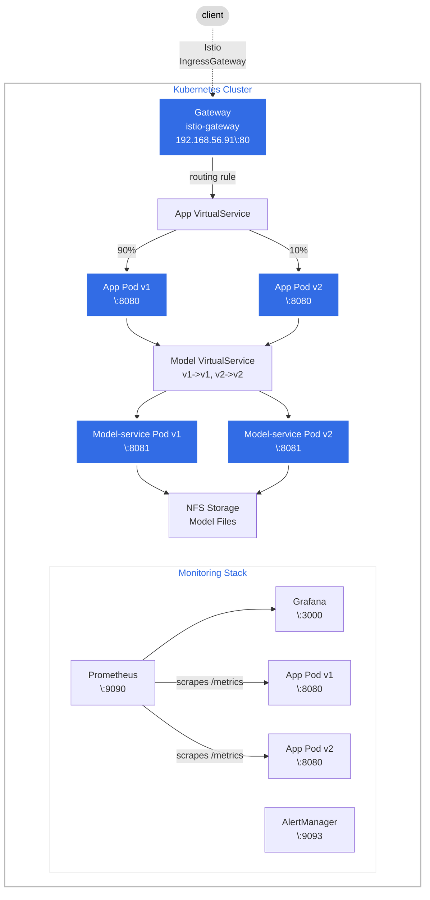

# Deployment Documentation

This document describes the complete deployment architecture of the SMS Spam Detection System on Kubernetes with Istio service mesh for traffic management and canary deployments.

---

## Table of Contents
1. [System Overview](#system-overview)
2. [Deployment Architecture](#deployment-architecture)
3. [Kubernetes Resources](#kubernetes-resources)
4. [Data Flow & Request Routing](#data-flow--request-routing)
5. [Istio Traffic Management](#istio-traffic-management)
6. [Monitoring Stack](#monitoring-stack)
7. [Additional Use Case: Rate Limiting](#additional-use-case-rate-limiting)
8. [Access Information](#access-information)

---

## System Overview

The SMS Spam Detection System is a microservices-based application deployed on a Kubernetes cluster provisioned via Vagrant. It uses Istio for traffic management, enabling canary deployments and A/B testing.

### Technology Stack

| Component | Technology | Port |
|-----------|------------|------|
| Frontend (app-service) | Spring Boot / Java 25 | 8080 |
| ML Backend (model-service) | Flask / Python 3.12 | 8081 |
| Shared Library | lib-version (Maven) | - |
| Orchestration | Kubernetes v1.30 | - |
| Service Mesh | Istio 1.25.2 | 80/443 |
| Monitoring | Prometheus | 9090 |
| Visualization | Grafana | 3000 |
| Alerting | AlertManager | 9093 |

### Repository Structure

| Repository | Purpose | Link |
|------------|---------|------|
| [operation](https://github.com/doda25-team6/operation) | Helm charts, Vagrant, Ansible, Kubernetes manifests | Main deployment |
| [app](https://github.com/doda25-team6/app) | Spring Boot frontend service | `ghcr.io/doda25-team6/app` |
| [model-service](https://github.com/doda25-team6/model-service) | Flask ML prediction service | `ghcr.io/doda25-team6/model-service` |
| [lib-version](https://github.com/doda25-team6/lib-version) | Version-aware Maven library | GitHub Packages |

---

## Deployment Architecture

### High-Level Architecture




### Infrastructure Layout

| Node | IP Address | Role | Components |
|------|------------|------|------------|
| ctrl | 192.168.56.100 | Control Plane | API Server, etcd, Scheduler, NFS Server |
| worker1 | 192.168.56.101 | Worker | Application pods |
| worker2 | 192.168.56.102 | Worker | Application pods |

---

## Kubernetes Resources

### Complete Resource Map

```
┌──────────────────────────────────────────────────────────────────────────────┐
│                            KUBERNETES RESOURCES                              │
├──────────────────────────────────────────────────────────────────────────────┤
│                                                                              │
│  DEPLOYMENTS                          SERVICES                               │
│  ════════════                         ═════════                              │
│  ┌─────────────────────────┐         ┌─────────────────────────┐             │
│  │ project-project-app     │────────▶│ -frontend :8080         │             │
│  │ (app v1, 3 replicas)    │         └─────────────────────────┘             │
│  └─────────────────────────┘                                                 │
│  ┌─────────────────────────┐         ┌─────────────────────────┐             │
│  │ project-project-app-v2  │────────▶│ (same service, v2 pods) │             │
│  │ (app v2, 3 replicas)    │         └─────────────────────────┘             │
│  └─────────────────────────┘                                                 │
│  ┌─────────────────────────┐         ┌─────────────────────────┐             │
│  │ project-project-app-    │────────▶│ -model :8081            │             │
│  │ model (v1, 3 replicas)  │         └─────────────────────────┘             │
│  └─────────────────────────┘                                                 │
|  ┌─────────────────────────┐         ┌─────────────────────────┐             │
│  │ project-project-app-    │────────▶│ (same service, v2 pods) │             │
│  │ model (v2, 3 replicas)  │         └─────────────────────────┘             │
│  └─────────────────────────┘                                                 │
│  ┌─────────────────────────┐         ┌─────────────────────────┐             │
│  │ -prometheus             │────────▶│ -prometheus :9090       │             │
│  └─────────────────────────┘         └─────────────────────────┘             │
│  ┌─────────────────────────┐         ┌─────────────────────────┐             │
│  │ -grafana                │────────▶│ -grafana :3000          │             │
│  └─────────────────────────┘         └─────────────────────────┘             │
│  ┌─────────────────────────┐         ┌─────────────────────────┐             │
│  │ -alertmanager           │────────▶│ -alertmanager :9093     │             │
│  └─────────────────────────┘         └─────────────────────────┘             │
│                                                                              │
│  CONFIGMAPS                           STORAGE                                │
│  ═══════════                          ═══════                                │
│  ┌─────────────────────────┐         ┌─────────────────────────┐             │
│  │ -config (MODEL_HOST)    │         │ PV: model-pv-nfs (1Gi)  │             │
│  │ -prometheus (scrape)    │         │        │                │             │
│  │ -grafana-datasources    │         │        ▼                │             │
│  │ -grafana-dashboards     │         │ PVC: model-pvc          │             │
│  │ -alertmanager-config    │         │   (ReadWriteMany)       │             │
│  └─────────────────────────┘         └─────────────────────────┘             │
│                                                                              │
│  ISTIO RESOURCES                                                             │
│  ═══════════════                                                             │
│  ┌─────────────────────────┐  ┌─────────────────────────────────────────┐    │
│  │ Gateway                 │  │ VirtualService: app-entry-service       │    │
│  │ (istio-gateway)         │  │ VirtualService: model-service-vs        │    │
│  └─────────────────────────┘  └─────────────────────────────────────────┘    │
│  ┌─────────────────────────┐  ┌─────────────────────────────────────────┐    │
│  │ DestinationRule         │  │ DestinationRule: app-dr (v1/v2 subsets) │    │
│  │ (sticky sessions)       │  │ DestinationRule: model-service-dr       │    │
│  └─────────────────────────┘  └─────────────────────────────────────────┘    │
│                                                                              │
└──────────────────────────────────────────────────────────────────────────────┘
```

### Resource Summary

| Type | Count | Names |
|------|-------|-------|
| Deployments | 7 | app (v1/v2), model (v1/v2), prometheus, grafana, alertmanager |
| Services | 5 | frontend, model, prometheus, grafana, alertmanager |
| ConfigMaps | 5 | app-config, prometheus-config, grafana-datasources, grafana-dashboards, alertmanager-config |
| Secrets | 1 | app secrets |
| PersistentVolume | 1 | NFS-backed model storage |
| PersistentVolumeClaim | 1 | model-pvc |
| Ingress | 1 | nginx ingress for project.local |

---

## Data Flow & Request Routing

### Request Flow

```
    ┌─────────────────────────────────────────────────────────────────────────┐
    │                         REQUEST FLOW                                    │
    └─────────────────────────────────────────────────────────────────────────┘

    Step 1: User Request
    ════════════════════
    User ──────▶ http://192.168.56.91/sms
                        │
                        ▼
    ┌───────────────────────────────────────────┐
    │  ISTIO INGRESSGATEWAY                     │
    │  - Entry point for all external traffic   │
    │  - IP: 192.168.56.91, Port: 80            │
    └─────────────────────┬─────────────────────┘
                          │
    Step 2: Gateway Match │
    ══════════════════════│
                          ▼
    ┌───────────────────────────────────────────┐
    │  GATEWAY (istio-gateway)                  │
    │  - Matches host: *                        │
    │  - Protocol: HTTP                         │
    └─────────────────────┬─────────────────────┘
                          │
    Step 3: Traffic Split │ ◄── ROUTING DECISION POINT (90/10)
    ══════════════════════│
                          ▼
    ┌───────────────────────────────────────────┐
    │  VIRTUALSERVICE (app-entry-service)       │
    │                                           │
    │  IF sticky session header/cookie matches: │
    │    → Route to consistent version          │
    │  ELSE:                                    │
    │    → 90% chance: v1                       │
    │    → 10% chance: v2                       │
    └─────────────────────┬─────────────────────┘
                          │
    Step 4: Subset Selection
    ════════════════════════
                          ▼
    ┌───────────────────────────────────────────┐
    │  DESTINATIONRULE (app-dr)                 │
    │                                           │
    │  Subsets:                                 │
    │    v1 → pods with label version=v1       │
    │    v2 → pods with label version=v2       │
    │                                           │
    │  Sticky Session:                          │
    │    consistentHash on x-user header        │
    └─────────────────────┬─────────────────────┘
                          │
    Step 5: App Processing│
    ══════════════════════│
                          ▼
    ┌───────────────────────────────────────────┐
    │  APP SERVICE POD                          │
    │  - Receives request                       │
    │  - Calls model-service for prediction     │
    └─────────────────────┬─────────────────────┘
                          │
    Step 6: Model Routing │ ◄── VERSION CONSISTENCY
    ══════════════════════│
                          ▼
    ┌───────────────────────────────────────────┐
    │  VIRTUALSERVICE (model-service-vs)        │
    │                                           │
    │  IF request from v2 app:                  │
    │    → Route to model-service v2            │
    │  ELSE:                                    │
    │    → Route to model-service v1            │
    └─────────────────────┬─────────────────────┘
                          │
    Step 7: Prediction    │
    ══════════════════════│
                          ▼
    ┌───────────────────────────────────────────┐
    │  MODEL SERVICE POD                        │
    │  - Loads model from NFS (/mnt/model)      │
    │  - Returns: {"result": "ham/spam"}        │
    └───────────────────────────────────────────┘
```

### Key Routing Decision Points

| Step | Component | Decision |
|------|-----------|----------|
| 1 | **IngressGateway** | Accepts external traffic on port 80 |
| 2 | **Gateway** | Matches host `*` and routes to VirtualService |
| 3 | **VirtualService** | **90/10 split** - routes 90% to v1, 10% to v2 |
| 4 | **DestinationRule** | **Sticky session** - consistent hash on `x-user` header / same cookie |
| 5 | **Model VirtualService** | **Version consistency** - v1 app → v1 model, v2 app → v2 model |

---

## Istio Traffic Management

### Gateway Configuration

The Gateway is configured outside the Helm chart during provisioning and uses configurable selectors:

```yaml
# Configurable in values.yaml
istio:
  gateway:
    name: istio-gateway
    selector:
      istio: ingressgateway  # Can be changed for other clusters
```

**IngressGateway Details:**
- **IP Address:** 192.168.56.91 (assigned by MetalLB)
- **Ports:** 80 (HTTP), 443 (HTTPS)
- **Selector Label:** `istio: ingressgateway`

### 90/10 Canary Split

```yaml
# Location: templates/istio-app-vs.yaml
http:
- match:
  - uri:
      prefix: /
  route:
  - destination:
      host: project-project-app-frontend
      subset: v1
    weight: 90   # ← 90% of traffic
  - destination:
      host: project-project-app-frontend
      subset: v2
    weight: 10   # ← 10% of traffic (canary)
```

### Sticky Sessions Implementation (Header-based)

```yaml
# Location: templates/istio-app-dr.yaml
trafficPolicy:
  loadBalancer:
    consistentHash:
      httpHeaderName: x-user  # Requests with same x-user always go to same version
```

**How it works:**
- If `x-user: alice` is sent, Alice always sees the same version
- Without the header, requests follow the 90/10 probability

### Version-Consistent Routing

```yaml
# Location: templates/istio-model-vs.yaml
http:
- match:
  - sourceLabels:
      version: v2   # If request comes from v2 app
  route:
  - destination:
      host: project-project-app-model
      subset: v2    # Route to v2 model
- route:              # Default: route to v1 model
  - destination:
      host: project-project-app-model
      subset: v1
```

---

## Monitoring Stack

### Monitoring Architecture

The monitoring stack provides observability into the application's behavior, supporting the continuous experimentation process. It consists of three main components that work together to collect, visualize, and alert on metrics.

**Prometheus** uses Kubernetes service discovery to automatically find and scrape metrics from the frontend application pods. The `version` label is preserved during scraping, which enables Grafana to compare v1 and v2 performance side-by-side during experiments.

**Grafana** provides visualization through two pre-configured dashboards: one for general application metrics and one specifically designed for experiment comparison. Both dashboards are auto-provisioned on startup via ConfigMaps.

**AlertManager** handles alerting when defined thresholds are exceeded. It groups related alerts together and sends email notifications via Gmail SMTP to notify the team of issues.

```
┌─────────────────────────────────────────────────────────────────────────────┐
│                            MONITORING STACK                                 │
├─────────────────────────────────────────────────────────────────────────────┤
│                                                                             │
│  ┌───────────────────────────────────────────────────────────────────────┐  │
│  │                        PROMETHEUS (:9090)                             │  │
│  │                                                                       │  │
│  │  Job: frontend                                                        │  │
│  │  Discovery: kubernetes_sd_configs (endpoints role)                    │  │
│  │  Scrape Interval: 30s                                                 │  │
│  │  Evaluation Interval: 30s                                             │  │
│  │                                                                       │  │
│  │  Scrape Target:                                                       │  │
│  │    ┌─────────────────────────────────────────────────┐                │  │
│  │    │ project-project-app-frontend                    │                │  │
│  │    │ :8080/metrics                                   │                │  │
│  │    │                                                 │                │  │
│  │    │ Custom Application Metrics:                     │                │  │
│  │    │   • click_rate_total (Counter)                  │                │  │
│  │    │   • time_on_site_seconds (Gauge)                │                │  │
│  │    │   • navigation_requests_total (Counter)         │                │  │
│  │    │   • page_load_seconds (Histogram)               │                │  │
│  │    └─────────────────────────────────────────────────┘                │  │
│  │                                                                       │  │
│  │  Labels Added:                                                        │  │
│  │    • pod (pod name)                                                   │  │
│  │    • service (service name)                                           │  │
│  │    • namespace                                                        │  │
│  │    • version (v1/v2 for experiment comparison)                        │  │
│  └───────────────────────────────────────────────────────────────────────┘  │
│                          │                                                  │
│           ┌──────────────┴──────────────┐                                   │
│           │                             │                                   │
│           ▼                             ▼                                   │
│  ┌─────────────────────┐     ┌─────────────────────────────────────────┐    │
│  │  ALERTMANAGER       │     │  GRAFANA (:3000)                        │    │
│  │  (:9093)            │     │                                         │    │
│  │                     │     │  Datasource: Prometheus                 │    │
│  │  Receives alerts    │     │                                         │    │
│  │  from Prometheus    │     │  Dashboards (auto-provisioned):         │    │
│  │                     │     │    • application-metrics.json           │    │
│  │  Routing:           │     │    • experimentation-dashboard.json     │    │
│  │    group_by:        │     │                                         │    │
│  │    [alertname,      │     │  Credentials: admin/admin               │    │
│  │     cluster,        │     │                                         │    │
│  │     service]        │     └─────────────────────────────────────────┘    │
│  │                     │                                                    │
│  │  Notification:      │                                                    │
│  │    Email via SMTP   │                                                    │
│  │    (Gmail)          │                                                    │
│  └─────────────────────┘                                                    │
│                                                                             │
└─────────────────────────────────────────────────────────────────────────────┘
```

The diagram above shows how data flows through the monitoring stack: Prometheus scrapes metrics from the frontend, enriching each metric with labels including the pod's version. This data feeds into Grafana for visualization and is evaluated against alert rules. When the `HighRequestRate` threshold is exceeded, Prometheus fires an alert to AlertManager, which routes it to the configured email receiver.


### Alert Rules

Prometheus evaluates alert rules defined in `prometheus-rules.yaml`:

| Alert | Expression | Threshold | Severity |
|-------|------------|-----------|----------|
| **HighRequestRate** | `rate(navigation_requests_total[1m]) * 60` | > 15 req/min for 2m | warning |

**Alert Configuration:**
```yaml
# prometheus-rules.yaml (ConfigMap)
- alert: HighRequestRate
  expr: rate(navigation_requests_total[1m]) * 60 > 15
  for: 2m
  labels:
    severity: warning
    component: frontend
  annotations:
    summary: "High request rate detected"
    description: "Service is receiving {{ $value }} requests per minute"
```

### AlertManager Routing

AlertManager receives alerts from Prometheus and routes them based on configuration:

```
                    Alert: HighRequestRate
                           │
                           ▼
              ┌────────────────────────┐
              │   ROUTE MATCHING       │
              │                        │
              │   match:               │
              │     alertname:         │
              │       HighRequestRate  │
              │                        │
              │   receiver: 'default'  │
              └────────────┬───────────┘
                           │
                           ▼
              ┌────────────────────────┐
              │   RECEIVER: default    │
              │                        │
              │   email_configs:       │
              │     to: configured in  │
              │         values.yaml    │
              │     smarthost:         │
              │       smtp.gmail.com   │
              └────────────────────────┘
```

**AlertManager Settings:**
- **Group By:** alertname, cluster, service
- **Group Wait:** 10s
- **Group Interval:** 10s  
- **Repeat Interval:** 12h
- **Email Configuration:** Requires `alertmanager-smtp` Secret with SMTP password

### Grafana Dashboards

Two dashboards are auto-provisioned from JSON files:

| Dashboard | File | Purpose |
|-----------|------|---------|
| **Application Metrics** | `dashboards/application-metrics.json` | General application monitoring |
| **Experimentation** | `dashboards/experimentation-dashboard.json` | v1 vs v2 comparison for A/B testing |

**Dashboard Loading:**
- Dashboards are mounted as ConfigMaps
- Path: `/var/lib/grafana/dashboards`
- Auto-loaded on Grafana startup via provisioning

### Metrics Flow Summary

```
App Pods ──/metrics──▶ Prometheus ──query──▶ Grafana (dashboards)
                           │
                           ├──evaluate rules──▶ HighRequestRate Alert
                           │
                           └──fire alert──▶ AlertManager ──email──▶ Team
```

### ConfigMaps Overview

| ConfigMap | Purpose |
|-----------|---------|
| `project-project-app-prometheus` | Prometheus scrape configuration |
| `project-project-app-prometheus-rules` | Alert rule definitions |
| `project-project-app-alertmanager-config` | AlertManager routing & receivers |
| `project-project-app-grafana-datasources` | Prometheus datasource for Grafana |
| `project-project-app-grafana-dashboards` | Dashboard provisioning config + application-metrics.json |
| `project-project-app-grafana-dashboards-experimentation` | experimentation-dashboard.json |


---

## Additional Use Case: Rate Limiting

Rate limiting is implemented to prevent service abuse:

```
┌─────────────────────────────────────────────────────────────────────────────┐
│                         RATE LIMITING FLOW                                   │
├─────────────────────────────────────────────────────────────────────────────┤
│                                                                             │
│    User Request                                                             │
│         │                                                                   │
│         ▼                                                                   │
│    ┌─────────────────────────────────────────────────┐                      │
│    │  Envoy Sidecar (in app pod)                     │                      │
│    │                                                 │                      │
│    │  Rate Limit Check:                              │                      │
│    │    Token Bucket: 10 tokens                      │                      │
│    │    Refill: 10 tokens per 60 seconds             │                      │
│    │                                                 │                      │
│    │  IF tokens available:                           │                      │
│    │    → Allow request, decrement token             │                      │
│    │  ELSE:                                          │                      │
│    │    → Return HTTP 429 (Too Many Requests)        │                      │
│    └─────────────────────────────────────────────────┘                      │
│                                                                             │
│  Behavior:                                                                  │
│    • Limit: 10 requests per minute per user                                 │
│    • Scope: Applied to app-service pods                                     │
│    • Response: HTTP 429 when exceeded                                       │
│                                                                             │
└─────────────────────────────────────────────────────────────────────────────┘
```

---

## Access Information

### Application URLs

| Service | URL | Description |
|---------|-----|-------------|
| **Web UI** | `http://project.local/sms` | SMS spam detection interface |
| **API** | `http://project.local/predict` | Direct prediction API |
| **Metrics** | `http://project.local/metrics` | Prometheus metrics endpoint |
| **Istio Gateway** | `http://192.168.56.91/` | Direct Istio access |

### Monitoring URLs

| Service | URL | Credentials |
|---------|-----|-------------|
| Prometheus | `http://192.168.56.100:9090` | None |
| Grafana | `http://192.168.56.100:3000` | admin/admin |
| AlertManager | `http://192.168.56.100:9093` | None |

### Testing Commands

```bash
# Regular request (follows 90/10 split)
curl http://192.168.56.91/

# Sticky session (header-based, always same version for alice)
curl -H "x-user: alice" http://192.168.56.91/

# Verify version routing
for i in {1..20}; do
  curl -s http://192.168.56.91/ | grep -o "v[12]" || echo "v1"
done
```

### Required /etc/hosts Entry

```
192.168.56.91  project.local
```

---
